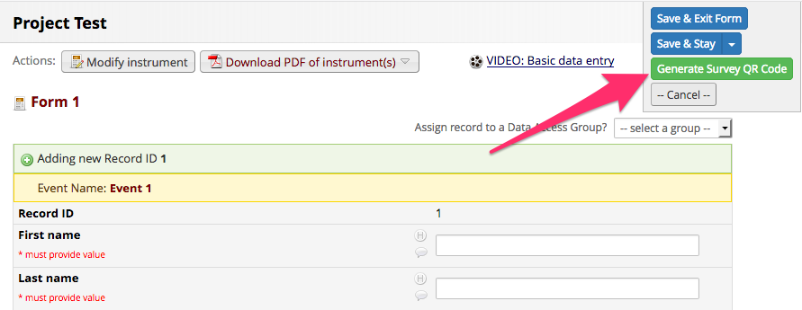
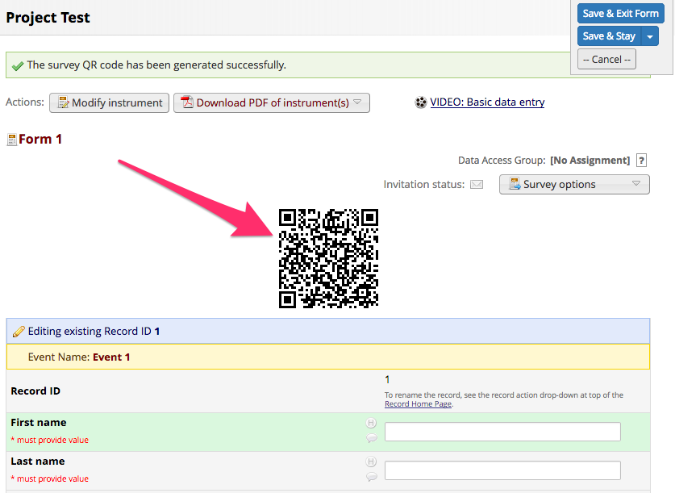

# QR Code Shortcut
This is a REDCap external module that provides a shortcut to generate a survey QR code for a new data entry.

## Prerequisites
- REDCap >= 8.0.0 (for versions < 8.0.0, [REDCap Modules](https://github.com/vanderbilt/redcap-external-modules) is required).

## Installation
- Clone this repo into to `<redcap-root>/modules/qr_code_shortcut<version_number>`.
- Go to **Control Center > Manage External Modules** and enable QR Code Shortcut.
- Go to your project home page, click on **Manage External Modules** link, and then enable QR Code Shortcut.

## Configuration
This module does not require further configuration - just make sure that surveys are enabled for your project.

## How to use it
Once you add a new record, you might see the **Generate Survey QR Code** button as follows:

Click on the button to see the survey QR code right away on your screen. Obs.: this operation will save your form.

